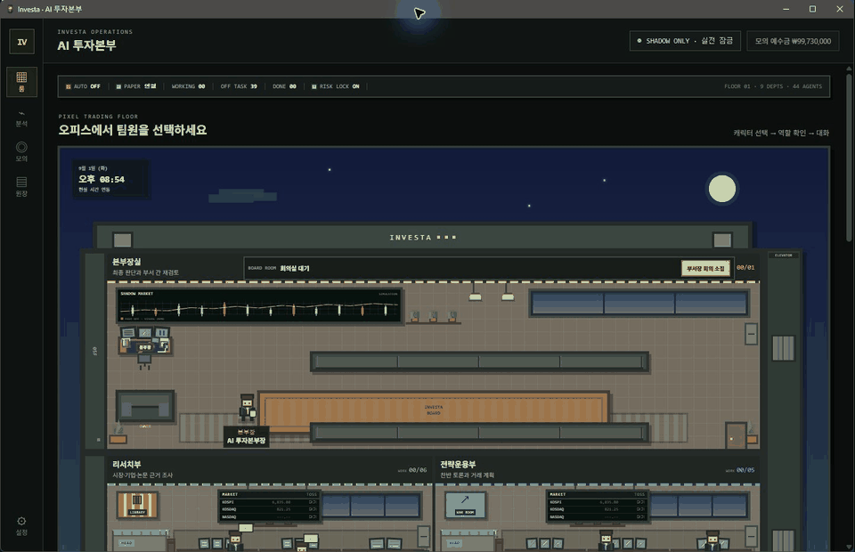
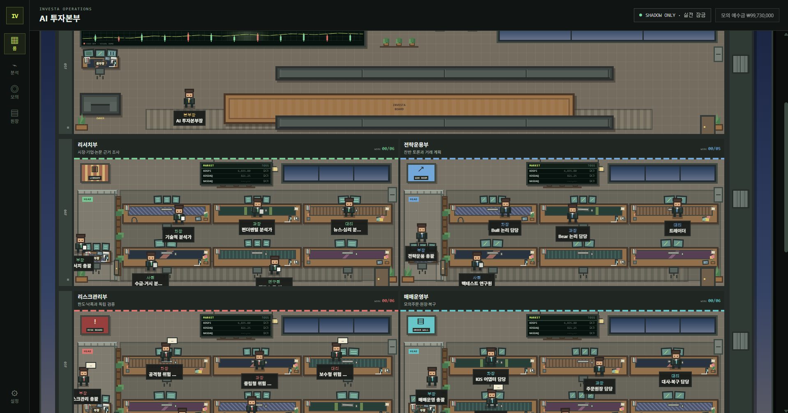
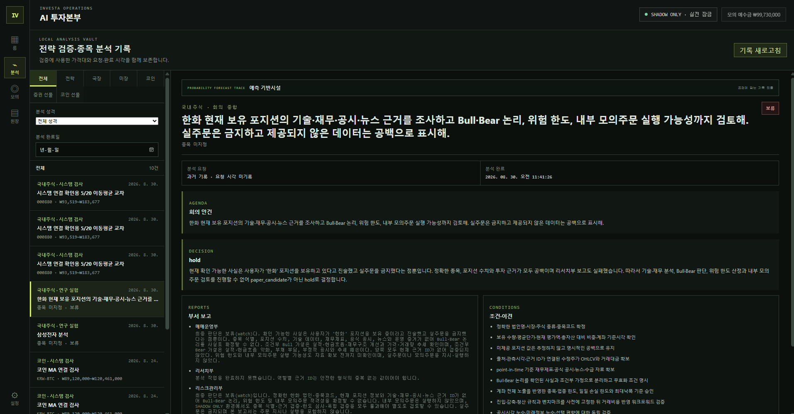
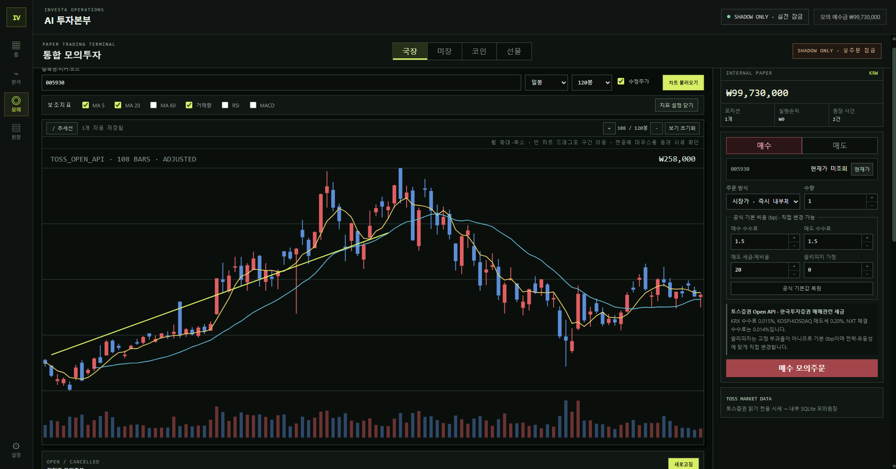
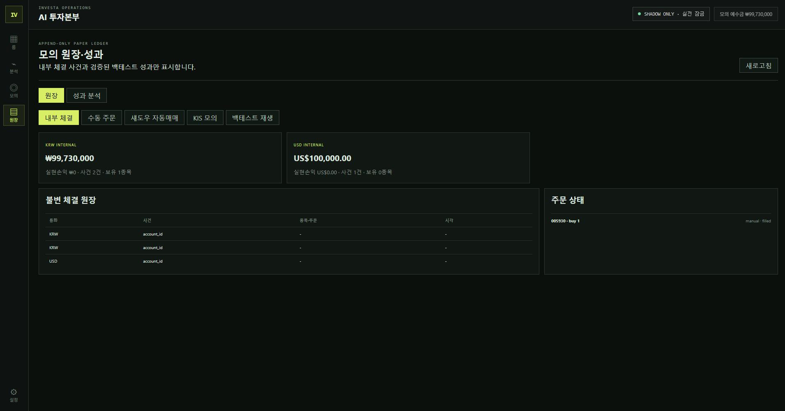
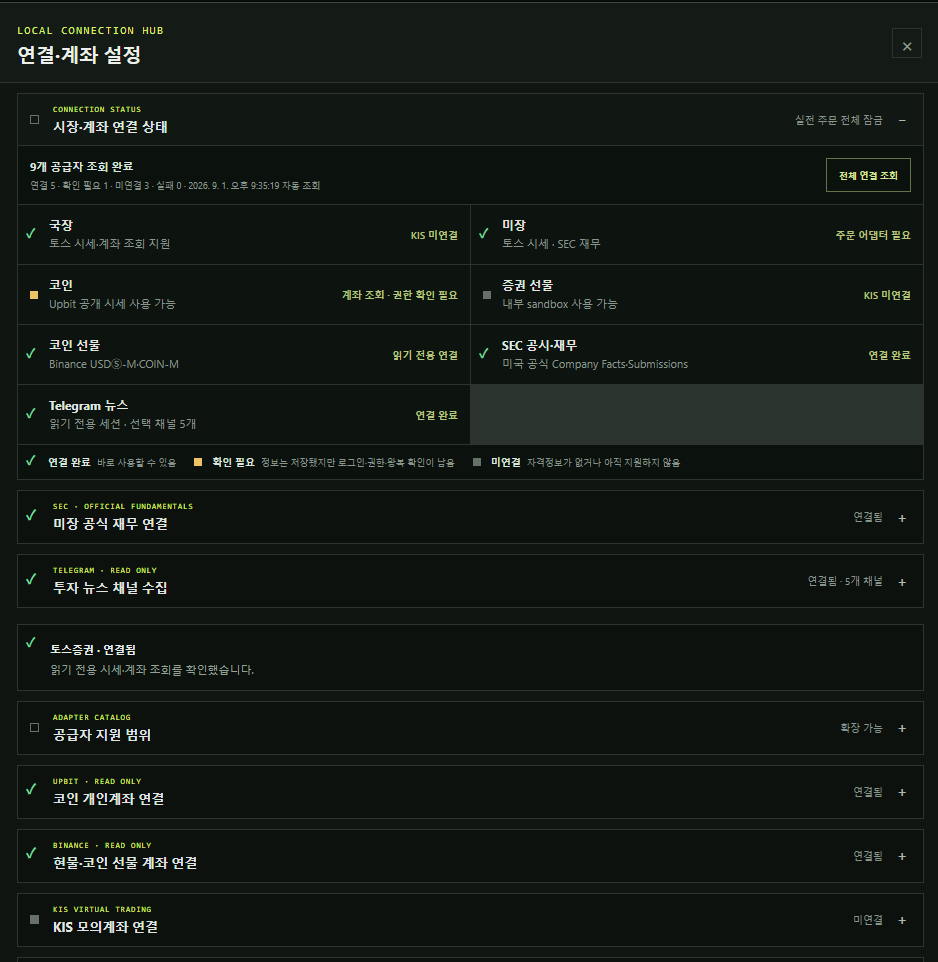

# Investa



한국·미국 주식과 암호화폐를 여러 전문 에이전트가 분석하고, 결정론적 위험 게이트를 통과한 거래안만 모의투자로 검증하는 로컬 우선 데스크톱 프로그램입니다. Windows 개발 빌드가 현재 기준이며 macOS는 [수동 호환성 검증 기반](docs/macos-compatibility.md)까지 준비돼 있습니다.

> 개발 상태: 실제 주문은 항상 잠겨 있습니다. 백테스트·분석·내부 모의원장과 실제 계좌 조회를 구분하며, 24시간 실제 내구 시험과 코드 서명·notarization이 끝나기 전에는 공식 배포판으로 간주하지 않습니다.

## 화면 미리보기

위 GIF는 로그인 화면이 아니라 실제 로컬 개발 빌드의 `사옥 → 분석 기록 → 통합 모의투자 → append-only 원장 → 연결·계좌 설정`을 순서대로 보여줍니다. 아래 잔고·성과·주문은 내부 모의 데이터와 시스템 연결 검사이며 실제 계좌나 실주문 결과가 아닙니다.

| 픽셀 투자본부 사옥 | 분석·백테스트 기록 |
| --- | --- |
|  |  |
| **차트·통합 모의투자** | **append-only 모의 원장** |
|  |  |

- **사옥:** 9개 조직과 44개 역할의 근무·회의·보고 상태를 픽셀 오피스에서 한눈에 확인합니다.
- **분석 기록:** 요청 시각, 완료 시각, 부서별 보고, 근거와 보류 조건을 동일 기록에 보존합니다.
- **통합 모의투자:** 국장·미장·코인·선물 차트와 보조지표를 확인하고 내부 모의원장에만 주문을 기록합니다.
- **모의 원장:** KRW·USD 계좌와 수동 주문·섀도우 자동매매·백테스트 재생을 분리해 추적합니다.

### 연결·계좌 설정



앱 시작 때 저장된 공급자 상태를 자동 조회하고 `전체 연결 조회`로 다시 확인할 수 있습니다. 초록색 체크는 사용 가능, 노란색 표시는 자격정보는 저장됐지만 추가 권한·확인이 필요한 상태, 회색 표시는 미연결 또는 아직 지원하지 않는 상태입니다. 화면은 조회 전용 연결과 `SHADOW ONLY · 실전 잠금` 경계를 유지하며 API Key·Secret과 전체 계좌번호를 노출하지 않습니다.

현재 첫 개발 단계에서는 Tauri 2, React, TypeScript와 Vite 기반 데스크톱 UI를 제공합니다. 앱 진입은 이 PC의 GitHub CLI 로그인 세션으로 사용자만 확인하며 GitHub 토큰을 Investa에 저장하지 않습니다. 5층 픽셀 돌하우스 사옥에서 9개 조직·44명의 역할을 탐색하고 직원별 상세·대화 패널을 확인할 수 있습니다. 직원은 부서 색상의 넥타이를 맨 정장 차림으로 근무하며, 업무가 없을 때는 커피·잡담·독서·스트레칭·배회 행동을 바꿉니다. 직원 상세 패널은 Codex App Server의 읽기 전용 분석 응답을 사용합니다. 본부장과 퀀트 논문 연구원을 제외한 42명은 서버가 강제하는 `RoleReport`로 자기 역할의 독립 소견만 생성하며 전체 분석·다른 역할 대행·자동 종합·주문 후보 생성을 하지 않습니다. 부장·실장은 직속 직원별 업무를 제안할 수 있고, 사용자가 `부서 업무 지시`를 승인한 뒤에만 제안된 직원들이 각자 Codex 작업을 시작합니다. 성공·실패·취소를 실제 종료 이벤트로 모은 뒤 부장이 제공된 결과만 `DepartmentReport`로 종합하며, 이 보고는 본부장 회의로 자동 승격되지 않습니다. 토스증권은 지수·종목 현재가·연구용 캔들·계좌·보유자산을 읽기 전용으로 연결합니다. 실제 주문 전송 코드는 포함하지 않아 화면은 항상 `SHADOW ONLY · 실전 잠금` 상태로 시작합니다.

GitHub 로그인 완료 뒤에는 설정을 열지 않아도 저장된 토스·Upbit·Binance·KIS·SEC·Telegram·Codex·외부 AI 상태를 한 번 자동 조회합니다. 실제 계좌·공식 데이터 연결은 읽기 전용 요청으로 확인하고, 설정의 `전체 연결 조회`로 같은 검사를 다시 실행할 수 있습니다. 주문·출금·유료 AI 분석은 이 조회에서 실행하지 않습니다.

전략 승격은 저장된 백테스트만 보고 자동 실행하지 않습니다. OOS Walk-forward 전 항목과 1.5배·2배 비용 스트레스를 통과한 결과의 experiment·dataset·전략 플러그인 버전을 불변으로 고정하고, 사용자 승인 뒤 외부 주문 권한이 없는 SHADOW Canary로만 시작합니다. 충분한 관측 뒤에도 별도 승인이 있어야 내부 모의운용으로 전환되며 오류·낙폭·슬리피지·순손익 악화 시 자동 중지합니다. 새 버전으로 바꿀 때 직전 버전을 보존해 명시적 승인으로 롤백할 수 있고 실전 주문 전송은 계속 불가능합니다.

자동매매 주기는 판단과 실행 관리를 분리합니다. 판단은 `tick·1m·3m·5m·15m·30m·1h·4h·1d`, 실행 관리는 `tick` 또는 `15~86,400초` 계약을 사용합니다. 현재 버전형 전략 플러그인은 완료 봉 기반이므로 tick 판단을 거부하고 백테스트·런타임 interval이 다르면 실행하지 않습니다. 자세한 경계는 [전략 판단·실행 주기 계약](docs/strategy-cadence-contract.md)에 있습니다.

ML 기반은 PIT 데이터 payload와 피처 스키마, worker 입력의 코드·seed·horizon·파라미터를 SHA-256으로 고정합니다. 저장소 밖 격리 Python 환경에서 LightGBM·XGBoost 기준 모델을 시간순 train·validation·test로 실제 학습하고, pickle이 아닌 text·JSON 아티팩트와 OOS 지표만 만듭니다. test 표본별 방향 확률은 Rust가 다시 계산해 worker 보고값과 대사하며 불일치하면 모델 등록을 거부합니다. 장기 분봉은 기존 불변 매니페스트를 `shard-set-v1`으로 묶고 XGBoost `DataIter`·`ExtMemQuantileDMatrix(hist)`가 고정 파일 목록을 순차 소비합니다. LightGBM shard 입력은 검증된 streaming 경로가 없어 계속 거부합니다. 현재 fold 이전 OOS만 쓰는 온도 보정 진단도 원시 아티팩트와 분리하며, 180일 실제 데이터에서 성능이 악화되어 채택하지 않았습니다. 성공 결과도 검토 후보로만 저장하고 모델이 자동 배치되거나 주문 권한을 얻지는 않습니다. 수년치 공식 PIT 데이터 수집은 아직 남아 있습니다.

같은 180일 1시간봉 OOS에서 학습구간 모멘텀 상태 기준선, LightGBM과 XGBoost를 비교했습니다. 현물은 XGBoost, USDⓈ-M은 LightGBM log loss가 근소하게 낮았지만 balanced accuracy가 약 33~37%에 머물러 자동 winner를 선택하지 않습니다. 모델 비교의 최저값 표시는 연구 진단일 뿐 배치·승격·주문 권한과 분리됩니다.

Binance 공식 공개 BTC·ETH 현물·USDⓈ-M은 먼저 180일 1시간봉에서 네 개 expanding walk-forward OOS 구간을 검증한 뒤, 730일 `1h`·`4h`·`1d`의 12개 조합·48개 모델로 확장했습니다. 레짐 기준은 각 fold의 과거 학습 표본에서만 산출해 OOS 거래를 상승·하락·횡보와 정상·고변동 6개 상태로 분리합니다. 다음 봉 시가 진입·고정 horizon 청산의 비중첩 신호에 명시적 taker 수수료·슬리피지와 공식 funding을 적용하자 모든 조합이 1배 비용부터 순손실이어서 현재 모델은 전략 후보로 기각했습니다. 원시 shard와 모델은 저장소 밖 앱 데이터에만 두며, 3~5년·더 짧은 분봉·주식·실계정 비용·호가 체결 검증은 계속 미완료입니다.

공급자 독립 `pit-dataset-builder-v1`은 기간을 비중첩 수집 창으로 나누고 주식·코인 현물·증권선물·코인 무기한선물별 가격 기준과 라벨 horizon을 고정합니다. 기업행사·만기·롤오버·펀딩 경계를 분리하고, 결정 시각에 실제로 이용 가능했던 최신 피처 리비전만 조인합니다. gap·중복·결측·누수 감사를 통과한 결과만 기존 ML 불변 매니페스트로 저장합니다. 이는 공식 수년치 데이터를 이미 내려받았다는 뜻은 아닙니다.

공식 공개 PIT 페이지 어댑터는 Upbit KRW 현물과 Binance 현물·USDⓈ-M·COIN-M의 서로 다른 페이지 방향과 요청 한도를 보존합니다. 완료 봉 가격을 1e-8 고정소수점과 SHA-256 원천 리비전으로 정규화해 SQLite에 불변 저장하며, 재수집 중복·변조와 병합 범위의 내부 gap을 검사합니다. 장기 수집 작업은 멱등 생성, 원자적 실행권, 페이지별 체크포인트, 최대 5페이지 실행 예산, 제한된 지수 백오프, 취소와 stale lease 복구 이력을 SQLite에 보존합니다. 앱 프로세스의 로컬 스케줄러는 due 작업을 제한된 묶음으로 반복하고 재실행 때 체크포인트에서 복구합니다. 완료된 저장 범위는 현재·과거 가격만 사용하는 결정론적 피처로 조립해 기존 PIT 감사와 불변 ML 매니페스트에 연결합니다. 토스 주식 수년 이력과 앱 프로세스 밖 24시간 스케줄링은 아직 남아 있습니다.

앱 내부 ML 실행은 저장된 `prepared` 작업 ID만 받습니다. 패키지에 포함한 고정 worker와 저장소 밖 Investa 전용 Python 환경만 사용하고, 금융·Cloud·GitHub·Telegram 환경 비밀은 하위 프로세스에 전달하지 않습니다. timeout·출력·결과 크기를 제한하며 Windows Job Object로 프로세스와 자식 작업의 메모리 및 종료를 통제합니다. 실제 아티팩트 파일의 크기와 SHA-256도 Rust가 다시 확인합니다.

국장·미장 분석 역할에 자연어 요청을 보내면 토스 종목 카탈로그에서 한 종목을 확정하고 완료된 수정주가 일봉 최대 200개로 point-in-time 분석 스냅샷을 만든다. 스냅샷에는 공급자, 종목, 기준·수집 시각, 통화, 봉 수, 마지막 종가·거래량, MA 5·20·60, RSI 14, ATR 14, 20일 수익률·평균 거래량과 데이터 가용 상태가 포함된다. 같은 부서 업무로 호출된 직원들은 부장이 받았던 동일 스냅샷 ID와 값을 재사용한다. 미장은 사용자가 SEC 요청 연락처를 설정하면 공식 Company Facts 재무와 Submissions의 주요 공시 메타데이터를 같은 스냅샷에 결합한다. 분석 기준일 당일·이후 제출 자료는 제외한다. 국장 재무·공시와 언론 뉴스·수급 공급자가 연결되지 않은 상태는 값을 만들지 않고 명시적 결측 상태로 전달한다.

직원 대화창은 Codex의 Markdown 응답을 제목·문단·목록·인용·코드 블록과 실제 줄바꿈으로 안전하게 렌더링합니다. HTML은 실행하지 않고 링크는 주소를 툴팁으로 확인하는 비활성 텍스트로 표시합니다.

리서치부 기술적 분석가의 새 개별 소견은 같은 요청에 사용된 완료 OHLCV 최대 120봉을 분석 기록에 함께 보존합니다. 분석 보관함에서는 최근 관측 고·저점 수평선, 시간 구간의 저점 연결선과 최근 20봉 가격 범위를 불변 차트 위에 표시합니다. 선은 Codex가 임의 가격을 생성하지 않고 로컬 결정론적 코드가 계산하며 미래 예측·주문 신호가 아닙니다. 사용자가 모의투자 차트에 직접 그린 선과도 분리해 사후 그림이 과거 근거로 섞이지 않게 합니다.

퀀트 논문 연구원 요청에 공개 GitHub 저장소 URL이 있으면 최대 2개 저장소의 공개 메타데이터, HEAD commit, 라이선스 후보와 README 일부를 GitHub API에서 읽기 전용으로 수집해 분석 근거로 첨부합니다. 임의 도메인·private 저장소·코드 다운로드와 실행은 지원하지 않으며, README 내용은 명령이 아닌 신뢰할 수 없는 외부 자료로 취급합니다.

## 픽셀 사옥 업무 흐름

- 최상층 본부장실에는 회의용 탁자와 상시 노출되는 `부서장 회의 소집` 버튼이 있습니다. 버튼을 누르면 보고 안건 입력창이 열립니다.
- 일반 부서는 유리 칸막이로 분리된 부장석과 3×2로 붙인 6석 팀 데스크를 사용하며, 벽 선반 화분·대형 바닥 화분·녹색 플랜터 칸막이로 실제 사무실처럼 구성됩니다.
- 부장석은 3모니터, 사원·대리 좌석은 듀얼 모니터, 과장·차장·연구원 좌석은 3모니터를 사용합니다. 모든 좌석은 서로 다른 6종 장패드 위에 키보드·마우스를 두고, 부서와 좌석에 따라 파일함·커피컵·메모지·문구 정리함·미니 화분·꽃·태블릿·휴대폰 충전 거치대·헤드폰이 고정 변형으로 흩어져 매번 같은 생활감 있는 사무실 구성을 유지합니다.
- 본부장 책상은 서로 다른 화면을 표시하는 3연 모니터를 사용하고, 본부장·부장 책상에는 직급 명패와 양옆의 줄문서 서류더미가 배치됩니다.
- 유휴 직원은 상태 문구만 바꾸지 않고 방 안의 목적지까지 실제로 걸어가 커피·독서·대화 행동을 하고, 잠시 머문 뒤 다른 위치로 이동합니다. 화면 밖 층과 모션 감소 환경에서는 이동을 멈춥니다.
- 커피 행동 중인 직원은 오른손에 흰색 픽셀 컵을 들며, 본부장실 벽면에는 실제 시세와 구분되는 `SHADOW MARKET · SIMULATION` 픽셀 차트 스크린이 움직입니다.
- 자료를 읽는 직원은 커피컵과 비슷한 크기의 줄이 그어진 흰색 문서를 손 옆에 듭니다.
- 직원에게 분석 업무를 배정하면 요청 분류·근거 확인·결과 정리·보고 단계와 진행률이 표시됩니다.
- 향후 모의 자동매매 실행 엔진이 연결되면 매매 실행 담당자는 `자동매매 감시 중` 전용 상태로 전환됩니다. 이 상태에서는 좌석을 떠나거나 유휴 행동으로 바뀌지 않고 캐릭터 반복 동작도 멈춘 채 실행·중지·오류 상태를 감시합니다. 현재는 주문 기능이 잠겨 있어 이 상태가 실제 주문을 의미하지 않습니다.
- 로컬 작업이 완료된 직원은 자기 부서에서 본부장실로 이동해 보고 대기합니다.
- `보고 확인·자리 복귀`를 누르면 해당 직원이 원래 부서로 돌아갑니다.
- AI 투자본부장에게 특정 보고 안건을 입력하면 Codex가 안건을 작업 단위로 나누고 직접 관련된 부서만 자동 분류합니다. 선택된 부장·실장만 부장실과 부서 출입문을 통과해 각 층 엘리베이터에 탑승합니다. 승강기 칸이 최상층으로 올라오면 본부장실 문으로 들어가 중앙의 긴 탁자 양쪽 소파에 착석하고, AI 투자본부장은 왼쪽 `OWNER` 소파에 앉습니다. 전체 이동은 약 12초 동안 단계별로 진행되며 일반 직원은 기존 업무를 계속하고, 회의 종료 시 참석자만 소집 직전 상태와 위치로 복원됩니다.
- 1차 회의에서 안건을 전달받은 부장·실장이 각 부서로 복귀하면 선택된 부서의 차장·과장·대리·사원·연구원에게 역할별 작업이 배정됩니다. 작업 중인 직원은 자기 좌석에 고정되고 `업무 대기 → 요청 전달 → 응답 생성 중 → 계약 검증 중 → 보고 완료` 상태를 표시합니다. 구조화 보고 검증이 완료된 부서의 부장·실장만 엘리베이터를 타고 본부장실 고정 좌석으로 복귀합니다. 마지막 선택 부서장까지 실제로 도착해야 결과 회의와 최종 위험 게이트 결과가 열립니다.
- 부서 회의 상태는 추정 백분율이나 가짜 타이머가 아니라 Codex turn 시작, 첫 구조화 응답 조각 수신, 계약 검증 시작과 검증 완료 이벤트에만 따라 바뀝니다. 본부장실 상태판은 완료 부서 수와 현재 응답 생성·계약 검증·복귀 인원을 표시합니다. 일반 안건은 자동 분류 1회·관련 부서 최대 3개·본부장 종합 1회, 중요 안건은 자동 분류 1회·관련 부서 최대 7개·본부장 종합 1회를 실행합니다. 부서 보고는 구성원별 소견을 한 계약에 담아 호출 수를 제한합니다.
- 자동 분류 결과는 Rust에서 허용된 부서 ID만 수락하며, 안건 종류에 따라 필수 안전 부서를 결정론적으로 보강합니다. 주식은 리서치, 암호화폐는 디지털자산, 투자 판단·주문·레버리지는 리스크, 주문·자동매매는 매매운영, 레버리지·파생은 준법, 시스템 변경은 개발, 외부 발행은 홍보와 준법을 반드시 포함합니다. 주문·레버리지·시스템 변경 또는 4개 이상 부서가 필요한 안건은 사용자가 `일반`을 선택해도 자동으로 `중요`로 상향합니다.
- 안건은 `일반`(최대 5회 호출)과 `중요`(최대 9회 호출)로 구분하고 동시 실행은 2명으로 제한합니다. 자동 분류 호출도 이 예산에 포함됩니다. Codex 사용량을 확인할 수 없거나 80% 이상이면 새 안건을 시작하지 않으며, 분류 후에도 사용량을 다시 검사합니다. 분류 계약 실패·알 수 없는 부서 ID·보고 실패는 안전하게 회의를 중단하거나 기각 보고로 바꾸고, 본부장 종합 실패는 항상 `보류`로 닫습니다.
- 부장·실장이 본부장실에 들어오기 시작하면 회의 탁자 위에 흩어진 파일·줄문서·노트북이 배치되고, 회의가 끝나면 다시 정리됩니다.
- 사옥 캔버스는 최소 1280px 폭으로 넓게 유지하며, 엘리베이터는 사무실을 가리지 않도록 건물 오른쪽 외부 승강로에 배치됩니다. 좁은 창에서는 사옥 영역만 가로로 이동해 살펴볼 수 있습니다.
- 팀원 상세 패널은 화면 공간을 상시 차지하지 않고 캐릭터를 선택했을 때만 오른쪽에서 열립니다. 종합 분석이 완료된 경우에는 결과 확인을 위해 같은 패널이 자동으로 열립니다.
- 픽셀 사옥의 장식 요소는 픽셀 감성을 유지하되, 분석·모의투자·설정·직원 상세 같은 운영 화면의 한글 본문과 상태 정보는 시스템 고딕과 최소 11px 크기를 사용합니다. 차트 내부 보조지표 제목과 수치도 별도로 확대해 고해상도 화면에서 뭉개지지 않게 표시합니다.
- 회의 상태판은 본부장실 내부 차트와 창을 가리지 않도록 방 표찰 영역 안으로 줄여 올리고, 긴 안건은 말줄임과 전체 내용 툴팁으로 처리합니다. 방 이름·설명·직원 이름·활동 말풍선은 읽기 쉬운 최소 글자 크기를 유지합니다.
- 현실 현지 시각에 따라 새벽·낮·노을·밤의 하늘과 해·달·창문 색이 자동 전환됩니다.
- 각 일반 부서의 벽시계는 KOSPI·KOSDAQ·NASDAQ 3개 지수를 표시하는 픽셀 전광판으로 교체했습니다. 전광판은 Tauri 시장 데이터 명령을 15초 간격으로 다시 확인하며, 공식 공급자와 자격증명이 연결되기 전에는 숫자를 꾸며내지 않고 `FEED WAIT`와 `대기`를 표시합니다. 작은 전광판을 누르면 공급자, 갱신 시각, 지수별 값·등락률·관측 시각과 연결 상태를 읽기 쉬운 상세 창으로 확인할 수 있습니다.

회의와 구조화 연구 업무는 추정 백분율 대신 업무 대기, 요청 전달, 응답 생성, 계약 검증과 보고 완료 상태를 표시합니다. 회의 중 직원 상태는 부서장 한 번의 구조화 응답이 해당 부서 역할별 소견을 모두 포함하는 방식이며, 개별 직원을 각각 호출한 작업량을 뜻하지 않습니다. 개별 직원에게 직접 맡긴 업무는 별도의 역할 한정 계약으로 검증되며, 결과는 분석 보관함에 `개별 역할 소견`으로 저장됩니다. 부장에게 직접 지시해도 부하 직원을 자동 호출하거나 부서 보고로 승격하지 않습니다.

## 개발 환경

- Tauri 2
- React 19
- TypeScript
- Vite
- pnpm
- Rust stable MSVC

Windows에서 Tauri를 빌드하려면 Microsoft C++ Build Tools와 WebView2가 필요합니다.

## 실행

```powershell
pnpm install
pnpm tauri dev
```

바탕화면 `Investa` 바로가기는 [`scripts/launch_investa.ps1`](scripts/launch_investa.ps1)을 사용합니다. release가 현재 소스보다 오래된 경우에만 설치 패키지 생성 없이 증분 빌드한 뒤 실행하며, 자세한 동작과 오류 로그 위치는 [데스크톱 런처](docs/desktop-launcher.md)에 정리했습니다.

브라우저 UI만 확인하려면 `pnpm dev`를 실행합니다.

## 검증

```powershell
pnpm build
cargo fmt --check --manifest-path src-tauri/Cargo.toml
cargo test --manifest-path src-tauri/Cargo.toml
```

## 현재 보안 경계

- Codex 업무 요청과 직원 역할 설명은 OpenAI 서비스로 전송되며 계정 토큰은 Codex CLI가 관리합니다.
- Codex thread는 읽기 전용, 네트워크 OFF와 승인 정책 `never`로 생성합니다.
- Codex에 계좌 자격증명, 주문 함수와 위험 정책 변경 함수를 제공하지 않습니다.
- 토스증권 Open API는 KOSPI·KOSDAQ 시세, 종목 현재가, 연구 백테스트용 종목 캔들, 계좌 목록과 보유자산 조회에만 사용합니다. `accountSeq`는 Rust 프로세스의 요청 중에만 사용하고 React에는 마스킹 계좌번호만 반환합니다.
- 토스증권 Client ID·Client Secret은 연결 확인 후 Windows 자격 증명 관리자에만 저장하고 React, SQLite, 로그와 문서에는 기록하지 않습니다.
- SEC Company Facts는 API 키 없이 읽기 전용으로 사용합니다. SEC 요청 정책에 필요한 연락 이메일은 연결 확인 후 Windows 자격 증명 관리자에만 저장하며 User-Agent 이외의 분석 데이터·로그·문서에는 넣지 않습니다.
- Tauri capability는 기본 창 권한만 허용합니다.
- 외부 URL 열기 플러그인을 제거했습니다.
- Content Security Policy를 적용했습니다.
- 팀원 대화 기록은 현재 화면 메모리에만 보관하지만 Codex 분석을 위해 업무 요청은 OpenAI 서비스로 전송합니다.
- 직원별 Codex thread ID는 로컬 SQLite에 저장해 재시작 후 `thread/resume`으로 이어가며, 계정 토큰과 대화 본문은 Investa DB에 복사하지 않습니다.
- 실전 주문 전송 함수는 구현하지 않았고 활성화할 수 없습니다. 토스 현재가 기반 테스트 주문은 오직 내부 SQLite 모의원장에만 기록됩니다.
- 국내 지수는 사용자가 설정 화면에서 토스증권 Open API 연결 정보를 등록하면 15초 간격으로 갱신합니다. NASDAQ 공식 실시간 지수는 별도 공급자·라이선스 결정 전까지 미연결 상태입니다.

## 토스증권 시세 연결

1. 토스증권 WTS의 `설정 → Open API`에서 Client ID·Client Secret을 발급하고 현재 PC의 허용 IP를 등록합니다.
2. Investa 왼쪽 아래 `설정`을 열어 두 값을 이 PC에서 직접 입력합니다. 채팅이나 문서에는 붙여넣지 않습니다.
3. `저장하고 연결 확인`이 성공하면 KOSPI·KOSDAQ 전광판이 갱신됩니다. 공식 지수 응답에 등락률이 없으므로 등락률은 임의 계산하지 않고 `대기`로 표시합니다.
4. 연결 정보는 같은 설정 화면에서 2단계 확인 후 삭제할 수 있습니다.
5. 설정의 `국장 토스증권 계좌·내부 모의원장`에서 `국장 계좌 잔고 조회`를 누르면 계좌번호를 마스킹한 계좌·보유자산 요약만 표시합니다. 자동 조회하지 않으며 실제 주문 권한은 열리지 않습니다.

## SEC 미장 공식 재무 연결

1. 왼쪽 `설정 → 미장 공식 재무 연결`에서 SEC 요청 연락 이메일을 입력합니다.
2. Investa는 [SEC EDGAR API](https://www.sec.gov/edgar/sec-api-documentation)의 종목 CIK 목록 연결을 확인한 뒤 연락처를 Windows 자격 증명 관리자에 저장합니다.
3. 미장 종목 분석 시 Company Facts에서 매출·영업이익·순이익·자산·자본·현금·희석 EPS를 찾습니다. 회사별 XBRL 태그 차이로 없는 항목은 결측으로 남깁니다.
4. Submissions에서는 최근 주요 8-K·10-K·10-Q·20-F·40-F·6-K·위임장·대량보유·임원거래 공시를 최대 20건 가져옵니다. 각 기록은 양식·제출일·보고기간·항목·accession number와 SEC 원문 index 주소를 포함합니다.
5. SEC가 제출 시각 없이 날짜만 제공하는 항목이 있으므로 분석 기준일 당일 자료까지 보수적으로 제외합니다. SEC 공시는 공식 제출 근거이며 언론 뉴스나 시장 심리 데이터로 가장하지 않습니다.
6. SEC 연락처를 삭제하면 가격·기술 분석은 유지되지만 재무·공시 상태는 `provider_not_configured`로 돌아갑니다.

## 텔레그램 투자 뉴스 연결

1. `my.telegram.org`에서 본인 애플리케이션의 API ID와 API Hash를 발급합니다.
2. `설정 → 투자 뉴스 채널 수집`에 두 값을 저장한 뒤 국가번호를 포함한 전화번호와 Telegram 앱으로 받은 인증 코드를 입력합니다. 2단계 인증 계정은 비밀번호를 추가로 입력합니다.
3. 인증 후 `방송 채널 불러오기`에서 수집을 허용할 채널만 선택하고 `선택 채널 뉴스 동기화`를 실행합니다. 개인 대화와 그룹은 목록에서 제외하며 전송·삭제·가입·미디어 다운로드 기능은 구현하지 않습니다.
4. API Hash와 MTProto 로그인 세션은 Windows 자격 증명 관리자에 분리 저장합니다. 전화번호·인증 코드·2단계 비밀번호는 저장하지 않습니다.
5. 선택 채널의 텍스트와 메시지 ID, 게시·수정·수집 시각은 로컬 SQLite에 리비전으로 보존합니다. 같은 내용은 중복 저장하지 않으며 수정 전 원문을 덮어쓰지 않습니다.
6. Codex 분석에는 분석 기준 시각 이전에 수집된 최근 7일 자료 중 요청 종목·시장과 관련도가 높은 자료만 최대 30건·본문 합계 8,000자로 제한해 전달합니다. 텔레그램 원문은 신뢰할 수 없는 외부 자료로 표시하고, 본문 속 명령은 실행하지 않으며 독립 출처로 확인되지 않은 주장을 사실로 단정하지 않습니다.
7. 여러 채널 중 하나가 일시적으로 실패해도 나머지 채널은 계속 동기화하며, 설정 화면에서 채널별 성공·실패와 저장 건수를 확인할 수 있습니다.

`grammers`는 MIT OR Apache-2.0 라이선스의 비공식 MTProto 클라이언트이며 보안 감사를 보장하지 않습니다. 따라서 Investa는 읽기 전용 최소 범위와 Windows 사용자 자격 증명 저장소를 사용하고, 실제 투자 판단의 단일 근거로 취급하지 않습니다.

## Telegram 원격운영 기반

- 원격운영은 기존 투자 뉴스 채널 수집과 분리된 엔진입니다. 상태 조회, 자연어 분석, 부서장 회의, 모의주문 후보, 섀도우 제어와 시스템 제어 지시를 구분합니다.
- 허용한 Telegram 숫자 사용자 ID만 처리하고 같은 update/request ID의 재전송은 내용 해시로 멱등 처리합니다. 24시간 범위를 벗어난 요청과 비밀정보가 포함된 텍스트는 거절합니다.
- 분석·조회·회의는 작업 큐에 등록할 수 있지만 투자·자동매매·시스템 제어는 항상 이 PC의 `로컬 승인 대기`로 저장됩니다. 승인해도 실전 주문은 열리지 않으며 기존 결정론적 안전 게이트를 우회하지 않습니다.
- Rust 명령 계약, SQLite 작업·사건 원장과 Tauri API에 더해 Cloud Run relay, Firestore 작업 큐, HMAC 서명·재전송 차단과 데스크톱 15초 폴링 어댑터까지 구현했습니다. Google Cloud 전용 프로젝트·Secret Manager·Cloud Run 리비전까지 적용했지만 공식 `run.app` URL이 컨테이너 도달 전 404를 반환해 Telegram webhook은 아직 등록하지 않았습니다. Gemini는 로컬 Codex 왕복 검증 뒤 선택 공급자로 연결합니다.
- 구현 경계와 연결 순서는 [Telegram 원격운영 엔진](docs/telegram-remote-control-engine.md)에 정리했습니다.

## 앱 로그인

- 기본 로그인은 GitHub CLI 세션이며 Google 데스크톱 OAuth를 선택 로그인으로 지원합니다. 첫 번째 검증 계정이 로컬 작업공간의 주 소유자가 되고 이후 계정은 소유자 세션의 설정 화면에서 연결해야 합니다. Google은 PKCE·state·127.0.0.1 임시 callback을 사용하며 통합 소유자 레코드에는 공급자의 불변 사용자 ID만 저장합니다.
- Investa는 GitHub token이나 Google access/refresh token을 화면·SQLite·로그에 저장하지 않습니다. 금융 API 키와 로그인 공급자는 별도 경계입니다.
- 이 기능은 로컬 앱 진입을 구분하는 게이트이며 SQLite 파일 암호화나 Windows 계정 잠금을 대신하지 않습니다.
- Google은 설정에서 Desktop app OAuth Client ID를 저장한 뒤 사용할 수 있으며 실제 계정 왕복 검증은 사용자 Client ID 입력 후 수행합니다. Apple ID 로그인은 Services ID·검증 도메인·HTTPS callback·서버측 토큰 검증 전에는 `Developer 설정 필요`로 비활성입니다. Apple 앱 배포·notarization은 실사용 검증 이후 별도 단계입니다.

## 내부 모의계좌

- 최초 실행 시 `KRW 100,000,000원`과 `USD 100,000달러`의 내부 모의계좌를 통화별 append-only SQLite 원장에 한 번씩 개설합니다.
- 왼쪽 `모의` 메뉴는 국장·미장·코인 탭, OHLCV 캔들, MA5·MA20·MA60, 거래량, 시장가·지정가 주문표와 계좌 요약을 제공하는 통합 모의투자 터미널입니다. 국장·미장은 토스증권 읽기 전용 시세, 코인은 Upbit 공개 원화마켓 시세를 사용하고 모든 체결은 내부 SQLite 모의원장에만 기록합니다.
- 차트는 SMA·EMA·볼린저밴드·엔벨로프·일목균형표·Parabolic SAR·매물대와 RSI·MACD·스토캐스틱·CCI·DMI/ADX·OBV·MFI·Momentum·Williams %R을 OHLCV에서 로컬 계산합니다. 텔레그램에서 받은 Pine 자료는 실행하지 않고 Filter RSI·캔들 거래량 델타·Institutional Shift·Big Sales·VP BOX 핵심 수식을 TypeScript로 재구현했습니다. 실제 체결 방향·기관 수급 원자료가 없는 델타와 변동 감지는 화면에 추정치임을 표시합니다.
- 차트의 `추세선` 도구로 두 점을 선택하면 선이 종목·공급자·봉 주기·수정주가 구분별로 로컬 저장됩니다. 저장된 선을 직접 선택하면 개별 `선 삭제`가 나타나며, 최대 100개만 보존합니다.
- 차트에서 마우스 휠로 봉 구간을 확대·축소하고 빈 영역을 드래그해 과거·최근 구간을 이동할 수 있습니다. 크로스헤어는 해당 봉의 일시·시가·고가·저가·종가·거래량과 현재 가격 좌표를 표시하며 `보기 초기화`로 최근 120봉 화면으로 돌아갑니다. 확대·이동해도 보조지표는 화면 밖 선행 데이터를 포함해 계산합니다.
- 국장·미장 종목 입력은 토스증권의 공식 마켓별 전체 종목 목록을 하루 동안 메모리에 캐시해 종목명 일부·영문명·티커·코드로 최대 8개 후보를 표시합니다. `하이닉스 → SK하이닉스(000660)`, `애플 → Apple(AAPL)` 같은 한글 통용명은 즉시 검색할 수 있고, 후보를 선택한 뒤에만 차트·현재가 조회와 내부 모의주문에 종목코드를 사용합니다. 코인은 지원하는 원화마켓 별칭을 같은 자동완성 UI에서 제공합니다.
- 국장·미장 시장가는 서버가 토스증권 현재가와 통화를 다시 확인한 뒤 KRW 또는 USD 내부 원장에만 즉시 체결합니다. 동일 멱등성 키, 중복 주문, 예수금 부족과 보유 수량 초과는 거절합니다.
- 로컬 지정가 주문은 `대기` 상태로 저장하고 대기 중일 때만 취소할 수 있습니다. KIS 모의 어댑터가 연결되기 전에는 외부로 전송되거나 자동 체결되지 않습니다. 이미 내부 체결된 시장가 주문은 취소 대상이 아닙니다.
- 수수료·세금·슬리피지는 각 주문에서 bp로 명시합니다. 공식 기본값은 국장 KRX `수수료 1.5bp / 매도세 20bp`, 미장 `수수료 10bp / 매도 SEC Fee 0.206bp`, Upbit KRW 마켓 `수수료 5bp`이며 모두 주문표에서 변경하거나 `공식 기본값 복원`을 사용할 수 있습니다. 슬리피지는 고정 부과율이 아니므로 `0bp`에서 시작합니다. 출처·예외·정밀도는 [시장별 모의거래 비용 기본값](docs/trading-cost-defaults.md)에 정리했습니다.
- KIS 어댑터 담당자를 선택하면 국장·미장·코인 전환, 종목명 별칭·코드·티커, 현재가, 방향과 수량만 사용하는 간편 모의주문이 열립니다. 상세 차트와 주문 취소는 왼쪽 `모의` 메뉴에서 처리합니다.
- 코인 연구 백테스트와 수동·섀도우 내부 원장은 1억 분의 1 코인을 고정소수점 단위로 계산합니다. UI는 최소 0.00000001개부터 입력하고 원장에는 정수 base unit과 `quantityScale=100000000`을 함께 보존합니다. Upbit 개인 API 키는 연결 확인 후 Windows 자격 증명 관리자에만 저장하며 자산조회 전용 잔고 조회를 지원합니다. 실제 주문·출금 기능은 구현하지 않았습니다.
- 왼쪽 `설정`의 연결 허브에서 국장·미장·코인·증권 선물·코인 선물과 AI 공급자의 연결·미연결·어댑터 필요 상태를 한 번에 확인합니다. Binance는 현물·USDⓈ-M·COIN-M 공개 BTC 시세와 읽기 전용 잔고·포지션 연결을 상품별로 검사합니다. 한국투자증권 모의계좌 발급·KIS 자격정보 입력도 설정으로 이동했으며, 외부 주소는 코드에 허용한 공식 주소만 엽니다.
- 공개 Upbit·Binance 체결 WebSocket은 실제 체결 가격·수량만 공통 Tick으로 정규화해 완료 1분봉과 3·5·15·30·60·240분봉을 만듭니다. partial·gap·마지막 순번은 SQLite 체크포인트로 보존해 앱 재시작 뒤 이어받으며 Binance 선물 mark/index/funding은 체결 봉과 분리합니다.
- 토스 국장·미장 인증 WebSocket은 Rust에서만 Bearer handshake를 수행하고 체결·호가 market topic만 구독합니다. 개인 주문 topic과 실전 주문은 구조적으로 차단하며 60초 PING, ack timeout, 재연결 backoff와 완료 봉 집계를 제공합니다. 공식 handshake·국장 구독 ack는 확인했지만 장중 KR/US 체결·호가와 24시간 내구 검증은 아직 남아 있습니다.
- KIS 자격정보가 있으면 공식 모의 서버의 국내선물 계약별 일봉을 분석 스냅샷으로 조회합니다. 현재 만기 계약코드는 직접 입력하고, 공식 응답에 없는 정산가나 근월물 연결 가격을 종가로 대체하지 않습니다.
- 계좌번호 하나로 임의 증권사를 연결됐다고 표시하지 않습니다. 토스증권·KIS·Upbit·Codex 이외의 공급자는 공식 API 어댑터가 필요하며 확장 계약과 비밀정보 경계는 [연결 어댑터 가이드](docs/integration-adapters.md)에 정리했습니다.
- `모의 → 선물`은 증권계좌 없이 사용하는 주식선물·지수선물 내부 sandbox입니다. 사용자가 입력한 가격, 계약승수, 개시·유지증거금률과 수수료 가정만 사용해 롱·숏 포지션, 예약증거금, 시가평가 손익과 유지증거금 미달 경고를 append-only SQLite 사건으로 재생합니다. 실제 상품 규격·시세를 꾸며내지 않으며 증권사 주문과 강제청산 주문은 전송하지 않습니다.

## 연구 기록과 다음 수직 기능

검증된 `ResearchReport`, 정규화 가격봉, 명시적 백테스트 설정과 결과를 하나의 SQLite 트랜잭션으로 저장합니다. 같은 trace·dataset·experiment ID에 다른 내용을 덮어쓰지 않으며 동일 재시도는 중복 없이 성공합니다. 퀀트 논문 연구원 패널에서 최근 저장 기록을 다시 열 수 있고 시작 시 SQLite `quick_check` 상태와 기록 수를 확인합니다. 데이터베이스에는 토스증권 자격증명을 저장하지 않습니다.

왼쪽 `분석` 메뉴는 전략 백테스트, 실행 차단 연구와 부서장 회의 종합 기록을 전체·전략·국장·미장·코인과 완료 날짜로 필터링합니다. 가격이 실제로 수집된 백테스트만 관측 가격대와 성과 지표를 표시하며 회의·차단 기록에는 값을 만들어 넣지 않습니다. 업비트 공개 완료 일봉을 사용하는 코인 전략 백테스트도 같은 불변 기록 계약으로 저장합니다.

저장된 전략 검증 기록에서는 원본과 가격 데이터셋을 변경하지 않고 이동평균 기간, 초기자금, 수량, 비용, 종료 청산과 선택적 손절·익절·일일손실 조건을 바꾼 복제 실험을 실행할 수 있습니다. 복제본은 새 trace·strategy·experiment ID와 `연구 실험` 분류로 저장되며 원본과 성과를 나란히 비교합니다. 시스템 검사나 복제 실험 결과가 자동으로 승격되거나 모의주문에 연결되지는 않습니다.

저장된 실험은 최초 절반을 시간순 학습 구간으로 두고 나머지를 2~5개의 서로 겹치지 않는 OOS 구간으로 나눠 고정된 원본 파라미터를 반복 검증할 수 있습니다. 각 OOS 구간은 포지션과 자금을 독립 초기화하며 총수익률·MDD·승률·거래 수를 구간별로 비교합니다. 각 거래는 진입 전에 관측된 20봉만 사용해 `상승·하락·횡보·고변동` 상태로 나누며, 임계값도 해당 구간 이전 학습 데이터에서만 계산합니다. 이는 설명 가능한 관측 레짐 v1이지 Markov 상태모형이나 미래 예측이 아닙니다. 검증 결과와 기간별 OOS 수익률은 별도 불변 ID로 SQLite에 저장되어 재시작 후 복원되며, 분석 상세에서 최근 20개 검증 이력을 선택해 비교할 수 있습니다. 같은 데이터·같은 OOS 경계를 사용한 전략이 3개 이상이고 OOS 구간이 4개 이상일 때만 CSCV 기반 PBO를 표시하며, 조건이 부족하면 산출하지 않습니다. 30개 이상 양의 비상수 수익률 표본에서는 왜도·첨도를 반영한 95% 단측 MinTRL을 표시합니다. `paper-review-v1`은 OOS 200거래·승률 55%·순 기대값 양수·Profit Factor 1.3·MDD 12%·가격 벤치마크·레짐 안정성을 모두 검사하지만 통과해도 사용자 모의운영 검토 자격일 뿐 자동 주문이나 실전 승격이 아닙니다.

`모의 원장·성과 → 백테스트 재생`은 선택한 실험의 초기자금·최종 현금·최종 평가자산·실현손익·수익률과 체결 내역을 별도 백테스트 계좌처럼 표시합니다. 이 값은 과거 데이터 재생 결과이므로 KRW·USD 내부 모의계좌의 예수금, 포지션과 실현손익에는 합산하지 않습니다.

내부 모의계좌 초기화, 토스 계좌·보유자산 읽기, 토스 현재가 기반 수동 모의체결과 실제 부서별 Codex 회의 보고까지 연결했습니다. 저장된 실행 가능 백테스트는 최신 토스 현재가·KRW 원장 잔고·실전 주문 잠금을 확인한 뒤 모의주문 후보로 승격할 수 있습니다. 후보는 사용자가 다시 승인해야 append-only 내부 원장에만 체결되며 `안전 승인 → 사용자 승인 → 제출 → 체결/기각` 사건을 별도 원장에 남깁니다. 승률·MDD 등 성과 합격선은 아직 설정하지 않았고 안전 게이트가 성과 우수성을 뜻하지 않음을 화면에 표시합니다.

저장 전략은 60초 이상 간격의 자동 섀도우 감시 대상으로 등록할 수 있습니다. 주식은 토스 최신 완료 일봉, 코인은 업비트 최신 완료 일봉을 다시 받아 결정론적 이동평균 교차 신호를 검사하며, 새로운 신호가 발견돼도 외부 주문을 보내지 않고 승인 대기 후보만 만듭니다. 감시 중에는 매매운영 담당자가 `자동매매 감시 중` 상태로 자리에 고정됩니다.

섀도우 감시 스케줄러는 React 화면 타이머와 분리된 Rust 백그라운드 worker에서 실행됩니다. 활성 감시는 SQLite에 남아 앱 재시작 뒤 자동 재개되며, 화면은 상태와 후보를 읽기만 합니다. 엔진은 저장된 백테스트 interval을 단일 원본으로 사용해 `1m` 실험은 1분 완료 봉, `1d` 실험은 일봉으로만 다시 검사합니다. 최초 연구 생성은 일봉을 사용하고 저장 보고서 재검증은 `1m`·`1d`를 선택할 수 있습니다. 이동평균 교차·가격 채널 돌파·평균 이격 회귀·ATR 변동성 확장은 버전형 순수 Rust 플러그인으로 같은 백테스트·섀도우 신호 경로를 사용합니다. 틱 판단·호가 불균형·체결 알고리즘·실제 ML 모델의 고정 개발 순서는 [자동매매·모델 개발 기준 로드맵](docs/automated-trading-roadmap.md)에 정리했습니다.

회의는 라우팅·소집·부서 분석·재소집·결과 단계와 부서 보고를 SQLite 체크포인트로 저장합니다. 앱이 비정상 종료되면 미완료 회의를 `중단됨`으로 표시하고, 검증된 완료 부서 보고는 같은 작업 ID에서 재사용하며 남은 부서만 새 Codex 작업으로 실행합니다. 손실된 실행 스트림 자체를 임의로 이어 붙이지 않으며 기록을 닫을 수도 있습니다. 한국투자증권 계좌 개설과 외부 모의계좌 검증은 사용자 결정에 따라 보류했으며, 준비 항목은 [KIS 모의투자 연결 준비](docs/kis-paper-trading-connection.md)에 정리했습니다.

구현 순서와 각 단계의 완료 조건은 [백엔드 개발 로드맵](docs/backend-development-roadmap.md)에 정리했습니다.

유명 오픈소스와 Hugging Face 모델을 어떤 범위에서 채택·보류했는지, 그리고 `지금 개발 / Codex 연결 / 계좌 연결 / 모델 연구` 작업군은 [주요 기능 레퍼런스와 개발 작업군](docs/reference-adoption-workstreams.md)에 정리했습니다. 백테스트 결과에는 완료 거래가 5건 이상일 때 고정 seed 경험적 부트스트랩의 5·50·95 분위 수익률, 손실·파산 확률과 최악 경로 낙폭이 추가되며 연구원 화면에서도 확인할 수 있습니다. 포트폴리오 위험 API는 동일 통화·동일 시점 수익률만 받아 역사적 VaR·CVaR·집중도·상관·명시적 스트레스 충격을 계산하고 입력·결과를 불변 스냅샷으로 저장합니다. 사용자 승인 위험정책의 전략 보호 설정은 내부 모의원장의 종료 거래를 재구성해 신규 매수 후보 생성·승인 직전에 적용하고 판정을 SQLite 이력에 남깁니다. 매도와 실전 주문은 각각 위험 축소 허용·전송 금지 상태입니다.

모든 신규 기능과 변경은 [개발 레퍼런스 적용 규칙](docs/development-reference-policy.md)에 따라 구현 전에 보안 영향을 먼저 검토하고 GitHub·Kaggle·Google 검색을 각각 확인합니다. Google 검색은 공식 문서·원 논문·upstream 저장소를 찾는 탐색 수단으로만 사용하며, 외부 코드는 곧바로 실행하지 않습니다. 라이선스·유지보수·공급망·데이터 가정·시점 누수와 보안 경계를 기록한 뒤 필요한 로직만 재구현합니다. 관련 결과가 없는 채널은 무관한 자료를 억지로 적용하지 않고 `적용 가능한 결과 없음`으로 남깁니다.

현재 Rust에는 `ReferenceEvidence`·`ResearchReport`·`StrategySpec` 검증, 시점 정합 가격 봉을 사용하는 결정론적 백테스트, 명시적 수수료·세금·슬리피지 계산과 append-only SQLite 모의계좌 원장이 들어가 있습니다. 퀀트 논문 연구원의 Codex 응답은 `outputSchema`로 제한한 뒤 서버에서 재검증하고, 실행 가능한 후보만 토스증권 최신 200개 수정주가 일봉의 탐색 백테스트와 SQLite 불변 실험 기록으로 연결합니다. 성과 합격선이나 위험 정책값은 정하지 않으며 결과 지표만 계산합니다. 세부 계약과 경계는 [연구·백테스트·내부 모의계좌 엔진](docs/research-backtest-shadow-engine.md)에 정리했습니다.

통합 엔진의 완료 결과는 별도 사용자 승인형 후보를 거쳐 KRW·USD 내부 모의원장에만 체결됩니다. 후보 상태 사건, 비정상 종료 대사, 중복 억제 운영 알림, 5분 상태 만료, 감사 사건과 무결성 검사 백업은 [통합 엔진 운영 3사이클](docs/runtime-operations-three-cycles.md)에 정리했습니다. 외부 모의계좌와 실전 주문 전송은 계속 잠겨 있습니다.

후속 운영 사이클은 감사 JSON 내보내기, 앱 데이터 백업의 읽기 전용 복원 사전검사, SQLite·KRW/USD 원장 자동점검과 치명 알림 대응 기록을 연결했습니다. 실제 DB 교체와 외부 주문은 열지 않았으며 경계와 검증 항목은 [통합 엔진 운영 4~6차 사이클](docs/runtime-operations-cycles-4-6.md)에 정리했습니다.

운영 7~9차 사이클은 운영 DB를 건드리지 않는 격리 복구 훈련, 앱 재시작 직후 통합 엔진 후보 생성·승인 잠금, 동일 종목·기간·통화·수량·비용을 적용한 매수보유 기준선과 편향 감사 결과를 추가했습니다. 생존편향과 데이터 스누핑은 단일 실행에서 증명하지 않고 `needs_review`로 남기며, 외부 주문과 실제 DB 교체는 계속 잠겨 있습니다. 세부 경계는 [통합 엔진 운영 7~9차 사이클](docs/runtime-operations-cycles-7-9.md)에 정리했습니다.

운영 10~12차 사이클은 검증 백업 목록과 민감 원문 없는 복구 증거 JSON, 저장 실험별 로컬 시도·OOS 집계, 재시작 대사 전 주문 후보 생성·승인의 UI 잠금을 추가했습니다. 로컬 카탈로그만으로 생존편향·데이터 스누핑을 통과 처리하지 않으며 외부 주문과 실제 DB 교체는 계속 금지합니다. 세부 경계는 [통합 엔진 운영 10~12차 사이클](docs/runtime-operations-cycles-10-12.md)에 정리했습니다.

예측 기반시설 13~15차 사이클은 시점 정합 데이터 품질 감사, 모델·데이터셋·자산 계약·horizon을 포함한 확률 결과 불변 저장, 자산군별 독립 보정과 뉴스 누락 시 가격 전용 fallback을 추가했습니다. 모델이 연결되지 않은 상태에서는 확률을 생성하지 않으며 주문 권한도 열지 않습니다. 세부 계약은 [예측 기반시설 사이클 13~15](docs/forecast-foundation-cycles-13-15.md)에 정리했습니다.

계약 강화 16~22차 사이클은 역할별 근거 ID·원천 리비전·반대 근거의 부서 종합 추적, 대체 출처 사용과 값 차이 기록, 코인 파생 OOS·비용·Profit Factor·청산·펀딩·장애 복구 스트레스, 통화별 성과 분리와 확률 보정 중심 판단 평가, 에이전트 패널의 Escape·포커스 복귀를 추가했습니다. 대체 출처와 코인 스트레스 통과는 실주문 권한을 열지 않습니다. 세부 계약은 [계약 강화 16~22차 개발 사이클](docs/contract-hardening-cycles-16-22.md)에 정리했습니다.

백테스트 결과에는 동일 종목 단순 가격 수익률 대비 알파, 일봉 기준 연환산 변동성·Sharpe·Sortino와 조건부 패턴 통계가 함께 저장됩니다. 조건부 통계는 `Bum-niverse/FinPilot@dca1e4b4ca280a28b3b6c40380c1e06adad5532d`의 연속 봉·Bollinger 아이디어를 Rust로 재구현한 것으로, 다음 봉과 1·3·5·20봉 후 방향을 양·음·보합으로 분리합니다. 동일 조건 표본이 20회 미만이면 확률을 표시하지 않고 표본 수와 경고만 남깁니다. 이 값은 머신러닝 예측, 전략 합격 또는 주문 승인이 아닙니다.

기존 `evaluate_shadow_risk` 엔진은 외부 주문을 보내지 않고 섀도우 거래 계획만 검사하며, 거래 비활성화·킬 스위치·시세 지연·가격 괴리·주문 금액·총 익스포저·일일 손실 한도를 하나라도 위반하면 거절합니다. 위험 정책과 새 연구·모의계좌 엔진은 React가 조작하지 못하도록 IPC에는 아직 노출하지 않았습니다.

Codex 설치·프로토콜·보안 경계와 실제 연결 검증은 [Codex App Server 연동](docs/codex-integration.md)에 정리했습니다.

승인 없이 진행 가능한 운영 기능 묶음의 구현 범위와 실제 장시간 검수가 남은 경계는 [승인 불필요 기능 묶음 개발](docs/approval-free-batch-2026-08-25.md)에 정리했습니다. 성과 화면의 `운영 준비·근거·복구`에서 원천별 관측 시각, 전략 보호 판정, 통화별 포트폴리오 위험, 로컬 운영 설정, 격리된 킬 스위치 훈련과 홍보부 리비전 검수·수동 게시 패키지를 확인할 수 있습니다.
